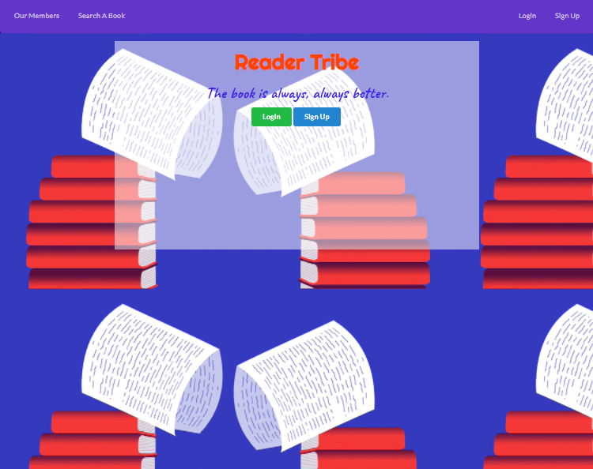
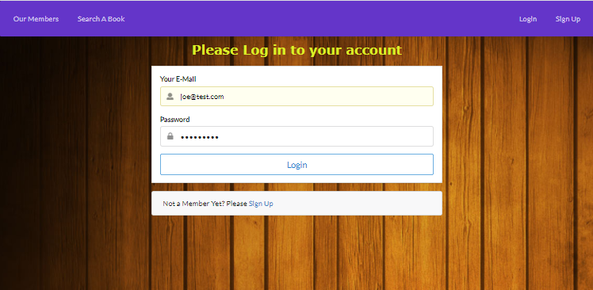
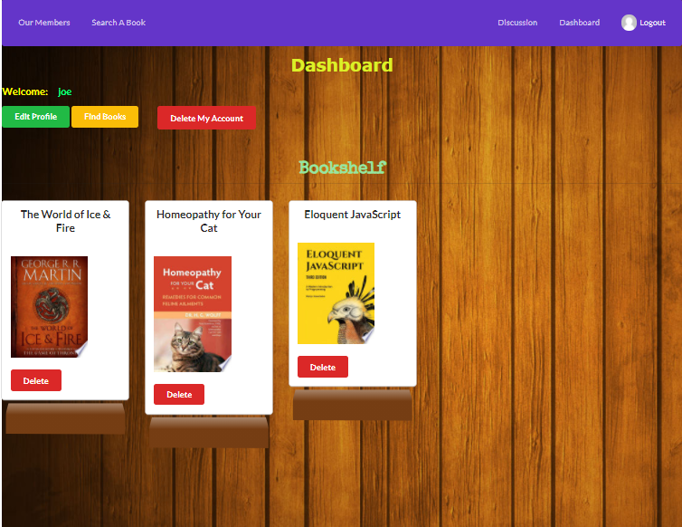

# MERN-Stack: Reader-Tribe


## Reader-Tribe

## Live URL
https://reader-tribe.herokuapp.com/

## Description
This MERN Stack project is for those book-lovers to find out books to read and users can post topics or opinions what they want to share or discuss with other members. 
## Table of Contents
* [License](#license)
* [Installation](#installation)
* [Tests](#tests)
* [Usage](#usage)
* [Packages](#packages)
* [Credits](#credits)
* [Questions](#questions)

## Installation
``` npm install ```
## Tests

``` npm install,  npm start ```
## Usage
User can search books after logged in the system, and save the selected books. User can create and edit personal profile, User can post topics to discuss with other members. They can delete posts whenever they want.

## License
MIT

## Packages
``` mongoose, axios, passport, react-router-dom, semantic-UI-react```

## Credits

* React.js
* Semantic UI React
* Passport.js
* MongoDB
* Express.js
* Node.js

## Questions
GitHub: https://github.com/miao0007

Email: miao188@hotmail.com

## Deployed Site Preview

### Landing Page

### Login

### Books Shelter
